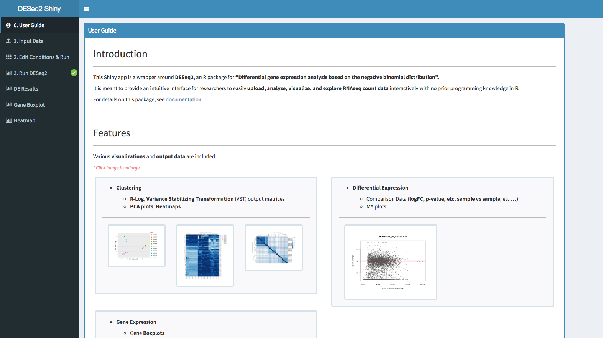

# DESeq2Shiny: Shiny app that wraps the <a href="https://bioconductor.org/packages/release/bioc/html/DESeq2.html" target="_blank">DESeq2</a> R package

### Introduction
---

This Shiny app is a wrapper around **DESeq2**, an R package for **"Differential gene expression analysis based on the negative binomial distribution".**

It is meant to provide an intuitive interface for researchers to easily **upload, analyze, visualize, and explore RNAseq count data** interactively with no prior programming knowledge in R.

This tool supports **simple or multi-factorial** experimental design. It also allows for exploratory analysis when no replicates are available.

### Online/Demo:
You can try it online at http://nasqar.abudhabi.nyu.edu/deseq2shiny

### Pre-print:
[NASQAR: A web-based platform for High-throughput sequencing data analysis and visualization](https://doi.org/10.1101/709980)

### Features
---
Various **visualizations** and **output data** are included:

*   **Clustering**

    *   **R-Log**, **Variance Stabilizing Transformation** (VST) output matrices
    *   **PCA plots**, **Heatmaps**

*   **Differential Expression**

    *   Comparison Data (**logFC, p-value, etc, sample vs sample**, etc …)
    *   MA plots

*   **Gene Expression**

    *   Gene **Boxplots**
      
      
---

