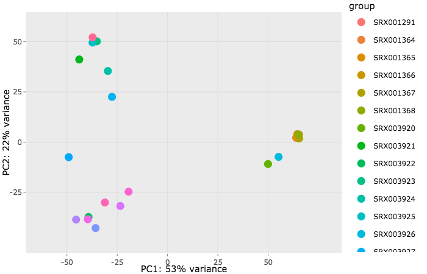
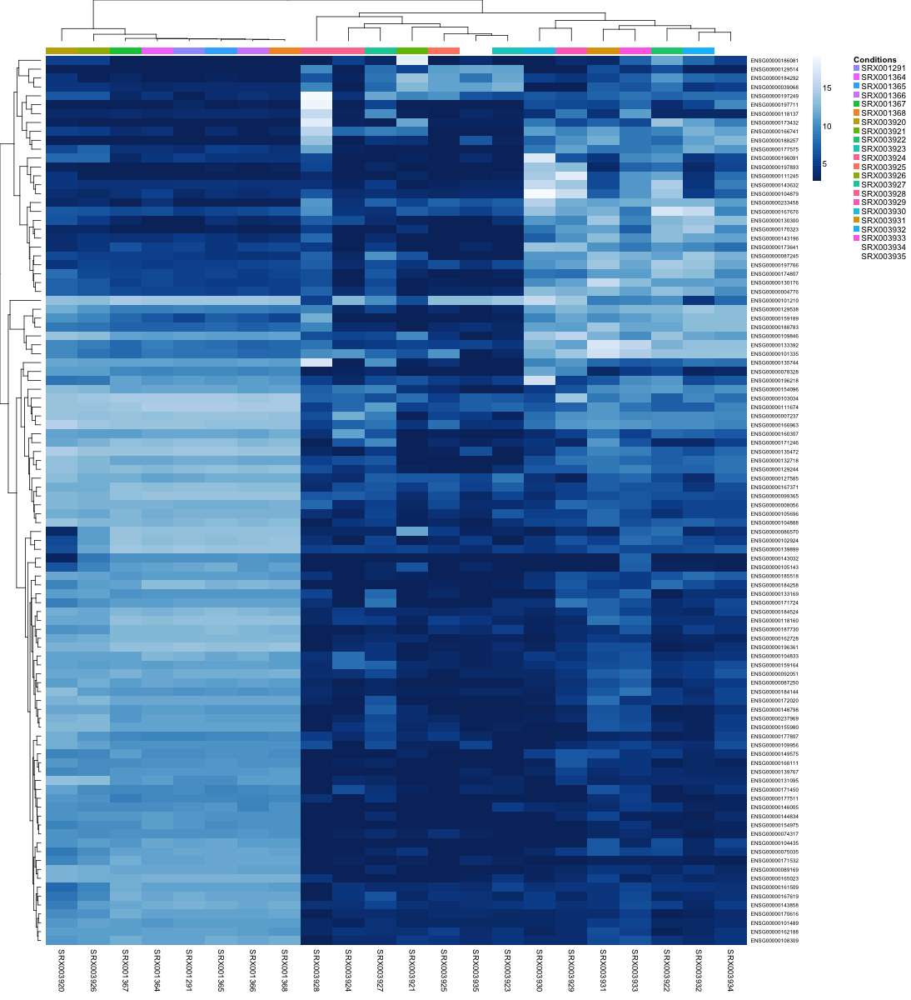
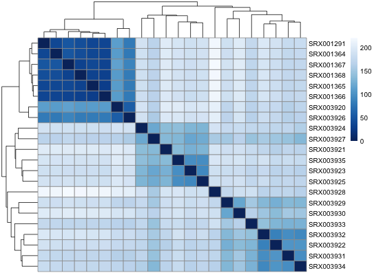
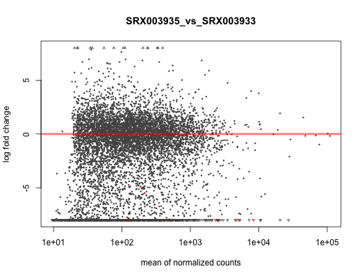
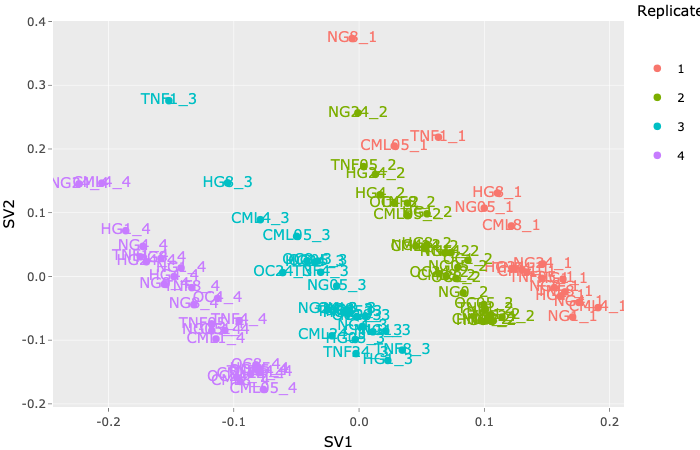
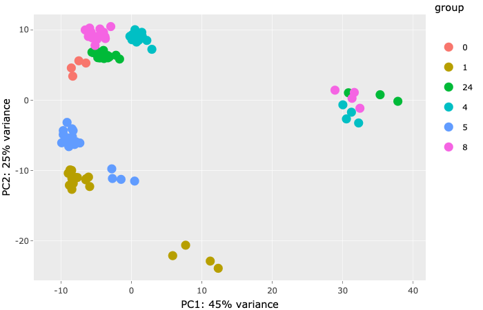
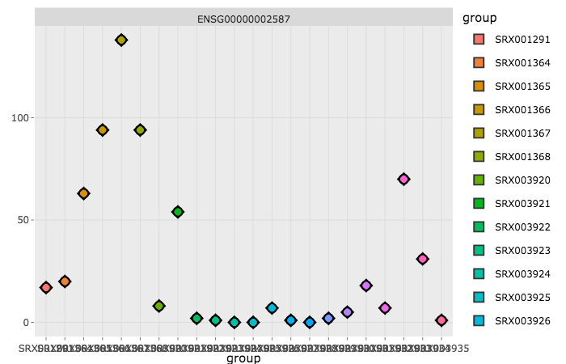
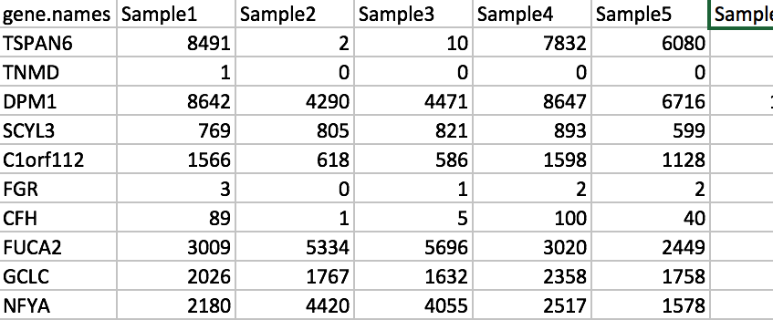

## Introduction

---

This Shiny app is a wrapper around <a href="https://bioconductor.org/packages/release/bioc/html/DESeq2.html" target="_blank">DESeq2</a>, an R package for **"Differential gene expression analysis based on the negative binomial distribution".**

It is meant to provide an intuitive interface for researchers to easily **upload, analyze, visualize, and explore RNAseq count data** interactively with no prior programming knowledge in R.

This tool supports **simple or multi-factorial** experimental design. It also allows for exploratory analysis when no replicates are available.

The app also provides svaseq **Surrogate Variable Analysis** for **hidden batch** effect detection. The user can then include Surrogate Variables (SVs) as adjustment factors for downstream analysis (eg. differential expression). For more information on svaseq, go to<a href="https://www.bioconductor.org/packages/devel/workflows/vignettes/rnaseqGene/inst/doc/rnaseqGene.html#using-sva-with-deseq2" target="_blank"> this link</a>

For details on how this package is used for RNASeq count data analysis and visualization, see <a href="https://bioconductor.org/packages/release/bioc/vignettes/DESeq2/inst/doc/DESeq2.html" target="_blank">documentation</a>

## Features
---

Various **visualizations** and **output data** are included:

<small><strong><em style="color:#f38686;">* Click image to enlarge</em></strong></small>

  
   

    

      <ul>
         <li>
            
<strong>Clustering</strong>

            <ul>
               <li><strong>R-Log</strong>, <strong>Variance Stabilizing Transformation</strong> (VST) output matrices</li>
               <li><strong>PCA plots</strong>, <strong>Heatmaps</strong></li>
            </ul>
         </li>
      </ul>

      

      
      

        <a class="pop">
            

                
            

        </a>
      

      

        <a class="pop">
            

                
            

        </a>
      

      

        <a class="pop">
            

                
            

        </a>
      

   

  

  
  
   

    

      <ul>
         <li>
            
<strong>Differential Expression</strong>

            <ul>
               <li>Comparison Data (<strong>logFC, p-value, etc, sample vs sample</strong>, etc …)</li>
               <li>MA plots</li>
            </ul>
         </li>
      </ul>
      

      

        <a class="pop">
            

                
            

        </a>
      

   

  

  
  

  
     

    

      <ul>
         <li>
            
<strong>Surrogate Variable Analysis</strong>

            <ul>
               <li>SV plots</li>
               <li>PCA plots</li>
            </ul>
         </li>
      </ul>
      

      

        <a class="pop">
            

                
            

        </a>
      

      
      

        <a class="pop">
            

                
            

        </a>
      

   

  

  
  
  
   

    

      <ul>
         
         <li>
            
<strong>Gene Expression</strong> 

            <ul>
               <li>Gene <strong>Boxplots</strong></li>
            </ul>
         </li>
      </ul>
      

      

        <a class="pop">
            

                
            

        </a>
      

   

  

  

    
              
      

      	<button type="button" class="close" data-dismiss="modal">&times;Close</button>
        
      

    

  

## Input File & Conditions

---

### 1. Example data (simple/multi-factorial experiment)

- It is recommended for the user to try oneor both of the pre-loaded example data sets to carry out the analysis and get familiar with the app. Then the user should be able to replicate the analysis on their own datasets.

- The **simple factorial example** loads the **Tissue Comparison Data (Human)** (RNASeq counts) that belongs to <a href="https://www.ncbi.nlm.nih.gov/pubmed?term=18978772" target="_blank">this published study</a>

- The **multi-factorial example** loads the **Mouse Data** (RNASeq counts and experiment design metadata) that belongs to <a href="https://doi.org/10.1038/ni.2710" target="_blank">this published study</a>

### 2. Upload your own data (gene counts)

- A .csv/.txt file that contains a **table of the gene counts**

- The first column should have gene names/ids followed by columns for sample counts. The file can be either **comma or tab delimited**

- If your counts are not merged, you can use this <a href="http://nasqar.abudhabi.nyu.edu/GeneCountMerger">Gene Count Merger</a> to consolidate all your sample count files

- For convenience, if this is a simple factor experiment and samples contain **replicates** and sample names are denoted by **underscore** and the replicate number (see **figure 2**), then the conditions will be automatically set by parsing the samples/replicate numbers

- If no replicates, then select **No replicates** option to help set the default experiment conditions for the next step. This is necessary because newer versions of DESeq2 (> 1.22.0) do not work on experiments with no replicates. See  <a href="https://bioconductor.riken.jp/packages/3.8/bioc/vignettes/DESeq2/inst/doc/DESeq2.html#can-i-use-deseq2-to-analyze-a-dataset-without-replicates" target="_blank">here</a> for more details

- Avoid using special characters or spaces in sample names (**figure 1**), other than underscores to denote replicates (**figure 2**)

- First column can either contain gene.ids or gene.names

- Prefilter: You can also set a minimum number of counts per gene to include

- For a **simple-factor experiment** sample counts file, download and view <a href="sampleCounts.csv" target="_blank">this</a> file

- For a **multi-factorial experiment** example file, download and view <a href="chenCounts.csv" target="_blank">this</a>  counts file and the following <a href="chenMeta.csv" target="_blank">metadata file</a>. 
- Experimental design meta data can either be uploaded as a csv file, or constructed in-page with in the "Edit Conditions" step

<strong>figure 1 (No Replicates)</strong>

    

    

<strong>figure 2 (Replicates)</strong>

    

### 3. Experiment Conditions

Setup experiment condition table

- By default, if there are replicates, the sample name will be set as the condition for those samples

- For example, if we take samples with replicates **(figure 2)**, the default condition table will be:

<strong>figure 3 (Condition Table)</strong>

    
    

---

